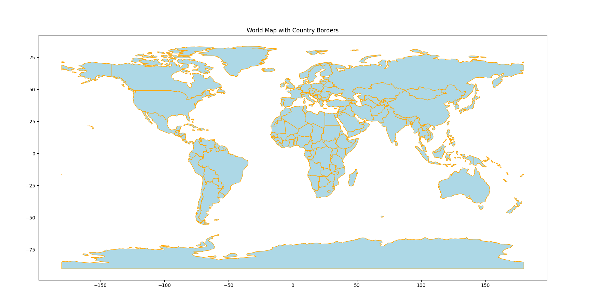

## World Map Plot with GeoPandas

This project uses Python and GeoPandas to plot a world map with country borders.

## Output

You can add a screenshot of your map by placing it in this folder and referencing it:

© mdkhademali